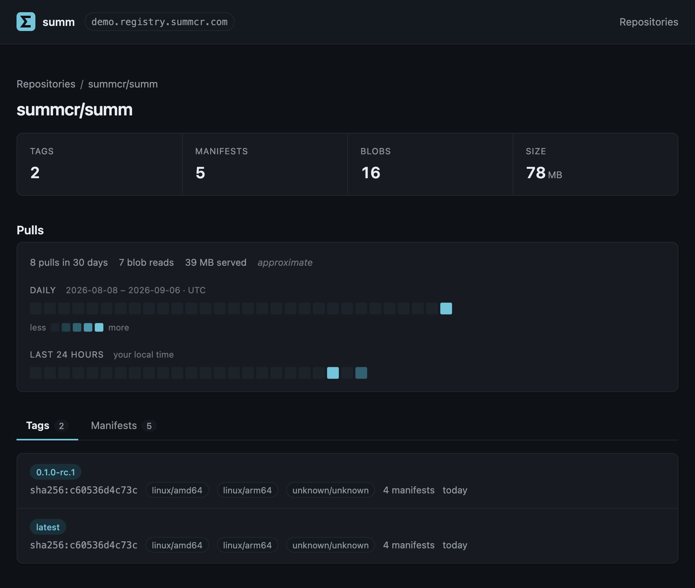

# summ Container Registry

[](https://github.com/summcr/summ/actions/workflows/ci.yml)
[](LICENSE)

**summ** is a simple yet powerful container registry with batteries included. It
fully supports the OCI Distribution Spec and adds the practical things a
registry should have had all along:

- Simple — a single binary, no additional databases needed
- Powerful — written in Rust, with a bespoke data structure for extremely efficient
  storage and retrieval of registry metadata, faster than
  [distribution](https://github.com/distribution/distribution)
- Batteries — built-in web UI, image pull statistics, tag history

## Live demo

https://demo.registry.summcr.com/r/summcr/summ

## Features

**A built-in web UI.** Browse repositories with their tag and manifest counts,
search names by substring, drill into a manifest, and see pull-count grids and
tag timelines.

**Pull counts, per day and per hour.** Every repository, tag and manifest gets a
thirty-day contribution grid and a last-24-hours strip, so "what is anyone
actually pulling" is a page to open rather than logs to parse.

**Tag history.** Every tag change is recorded from the first push, so you can
ask what a tag has pointed at over time *and* what names a manifest has had.
One endpoint answers both, addressed by tag or by digest, newest first and
cursor-paged.



*A repository page: tag, manifest, blob and size counts, the thirty-day and
last-24-hours pull grids, and the tags with the platforms each one covers.*

**Simple, practical auth.** `--auth-mode open|public-pull|private` sets who may
push and pull, using API keys, and applies to `/v2/`, the discovery API and the
UI alike. Details in [docs/auth.md](docs/auth.md).

**Auto cleanup of orphaned layers.** A background purge reclaims layers nothing
references any more and repositories left empty, behind a grace
period so it never races a push. Turn on `--purge-untagged` and it removes
untagged manifests too. `POST /api/v1/purge` runs a pass on demand, and
`?dry-run=true` shows what it would take first.

**Discovery as a first-class API.** `/api/v1/` serves repositories, tags,
manifests, tag history and pull counts as a flat, cursor-paged API, plus
repository delete and purge. Every list takes a cursor and a limit, and nothing
loads an unbounded set, because the design target is 10M repositories and up to
10M manifests in a single one. The discovery API and `/v2/` are documented in
[docs/api.md](docs/api.md).

**Conformant.** summ passes the OCI `distribution-spec` conformance suite with
zero failures at every profile, including the OCI 1.1 referrers API: 1032
checks pass at the suite's `dev` profile, with nothing skipped.

## Use cases

**Run your own registry, instead of pulling against someone else's limit.**
Docker Hub rate-limits anonymous and free-tier pulls, and so does
[ECR Public](https://docs.aws.amazon.com/AmazonECR/latest/public/public-service-quotas.html);
[ECR](https://docs.aws.amazon.com/AmazonECR/latest/userguide/service-quotas.html) and
[GAR](https://docs.cloud.google.com/artifact-registry/quotas) meter requests
against per-region quotas and bill every byte that leaves the region.
Meanwhile a scaling cluster and a CI matrix fetch the same few base images
hundreds of times a day. Copy them into summ once — `skopeo copy`, `oras cp`,
or a job that runs on merge — and the pulls land on a registry you run, at your
network's speed, with no quota to exhaust.

**A throwaway registry for integration tests and CI.** One binary and a
directory — `summ serve --data-dir "$(mktemp -d)"` — no daemon, no compose file,
no service container to wait on. Bind it to loopback and Docker pushes to it
without an `insecure-registries` entry; delete the directory when the run ends.
Tests assert on what was pushed through the discovery API rather than by
grepping output.

**A home for OCI artifacts that are not images.** Helm charts, WASM modules,
SBOMs, signatures, attestations, model weights — push them with `oras push` or
`helm push` like any other registry. The referrers API is implemented and passes
conformance, `artifactType` filtering included, so whatever is attached to an
image is discoverable by the tools that go looking.

**An air-gapped, edge or embedded registry.** One statically linked file, no
runtime dependencies, and a UI compiled into the binary that loads nothing from
a CDN — a machine with no route to the internet gets exactly the same registry
as one on the public network. Small enough to ship inside a product, an
appliance or a cluster bootstrap.

**Finding out what your registry is actually for.** Which repositories anyone
still pulls, when a tag last moved and what it pointed at before, whether a
manifest has ever been called anything else — questions most registries cannot
answer at all. summ answers them on the page you were already looking at.

## How summ compares

summ is built to be easy to install and operate: one binary, nothing else to
run. It is not trying to be a comprehensive registry like Harbor. The table
compares it with distribution, the reference implementation, and Harbor.

|                            | summ                              | [distribution](https://github.com/distribution/distribution) | [Harbor](https://goharbor.io)                |
|----------------------------|-----------------------------------|--------------------------------------------------------------|----------------------------------------------|
| **Setup**                  |                                   |                                                              |                                              |
| Install                    | One binary or one container       | One binary or one container                                  | Installer script or Helm chart               |
| Processes to run           | 1                                 | 1                                                            | 9 containers, plus optional Trivy            |
| Required dependencies      | None                              | None (filesystem storage)                                    | PostgreSQL and Redis                         |
| Configuration to start     | None; defaults work               | YAML config file (the image ships a default)                 | `harbor.yml`, then generated compose         |
| Air-gapped friendly        | Yes; UI compiled in, no CDN       | Yes                                                          | Offline installer bundles the images         |
| **Features**               |                                   |                                                              |                                              |
| Web UI                     | ✅ built in                        | ❌                                                            | ✅                                            |
| Pull counts                | ✅ per day and hour                | ❌                                                            | Total per repository, last pull per artifact |
| Tag history                | ✅ by tag or digest                | ❌                                                            | Audit log only                               |
| Cursor-paged discovery API | ✅ `/api/v1/`                      | `_catalog` only                                              | ✅ REST API (page/size)                       |
| OCI 1.1 referrers API      | ✅ with `artifactType` filtering   | ✅                                                            | ✅                                            |
| Orphan cleanup             | ✅ background, with grace period   | Offline `garbage-collect`; registry read-only or stopped     | ✅ scheduled GC                               |
| Object-store backends      | 🚧 Planned; local filesystem today | ✅ S3, GCS, Azure                                             | ✅                                            |
| Auth                       | API keys, three modes             | htpasswd, or a separate token server                         | Users, RBAC, LDAP, OIDC                      |
| **Beyond summ's scope**    |                                   |                                                              |                                              |
| Vulnerability scanning     | ❌                                 | ❌                                                            | ✅ Trivy                                      |
| Replication                | ❌                                 | ❌                                                            | ✅                                            |
| Multi-tenant projects/RBAC | ❌                                 | ❌                                                            | ✅                                            |

## Quick start

Run the binary, or run the container. Either way you get a complete registry on
`http://127.0.0.1:3110` — nothing else to install, configure or stand up
alongside it.

### Prebuilt binary

```sh
curl -fsSL https://summcr.com/install.sh | sh
./summ serve
```

The installer verifies a checksum and leaves a single `summ` in the current
directory — no PATH edits, no service files, no sudo. Data goes in `./data`
beside the binary; `--data-dir` puts it elsewhere. Platform assets, checksums
and building from source are in [docs/setup.md](docs/setup.md).

### Docker

```sh
docker run -d --name summ -p 3110:3110 -v summ-data:/var/lib/summ summcr/summ
```

The image is multi-architecture, so that line is the same on x86_64 and arm64.

summ writes everything to `/var/lib/summ`, which `-v summ-data:/var/lib/summ`
keeps on a named volume so it survives the container. **Name the
volume** — drop the `-v` and you still get one, but an anonymous volume that
`docker run --rm` deletes along with the container. A bind mount works too,
after `chown 10001:10001` on the host directory.

### Check it works

```sh
curl http://127.0.0.1:3110/v2/     # {}
```

Then open <http://127.0.0.1:3110> for the web UI, and push an image at it:

```sh
docker tag alpine 127.0.0.1:3110/demo/alpine
docker push 127.0.0.1:3110/demo/alpine
```

Docker treats the whole `127.0.0.0/8` range as insecure by default, so there is
nothing to configure. Other clients make their own rules — `oras` and `crane`
have to be told an endpoint is plain HTTP.

More in [docs/setup.md](docs/setup.md), including platform requirements and
building from source, [DEPLOYMENT.md](DEPLOYMENT.md) for running summ as a
service behind TLS, and [docs/data-dir.md](docs/data-dir.md) for what summ
stores and how to back it up.


### Agents
[AGENTS.md](AGENTS.md) contains operating manual for AI agents.
